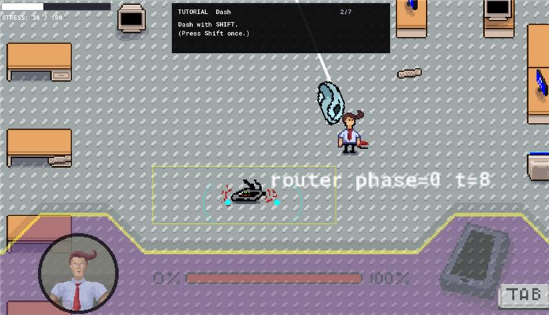

# Who's The Masked One (koDir'o) — Game Jam 2026

> **⚠️ PROJECT STATUS:** This repository represents a **game jam prototype containing a single playable mission**, serving as a functional vertical slice to showcase core mechanics and narrative concepts rather than a fully finished game.

**Who's The Masked One** is a 2D top-down pixel art dungeon crawler with shooter elements, melee mechanics, and a unique in-combat smartphone interaction mechanic. Created for **Game Jam 2026** by team **koDir'o**, this build demonstrates the core gameplay loop, financial mechanics, custom enemy behaviors, interactive messaging systems, and psychological narrative design intended for the full concept.



---

## 👥 The Team (koDir'o)

* **Eldar Dacic**
* **Ammar Omerika**
* **Abullah Ahmed Pasa**
* **Haris Smajic**
* **Muamer Klico**

---

## 📖 Deep Dive: Backstory, Theme & Psychological Conflict

The core thematic foundation of *Who's The Masked One* explores the erosion of human identity under digital reliance and psychological manipulation.

### The Lore & Premise

You control **Heck**, a high-profile businessman who leads a fraught double life:

* **The Surface Life:** Heck navigates a crumbling personal life split between his **Wife** (representing his grounded past, commitment, and stability) and his **Mistress** (representing escapism, impulsivity, and emotional danger).
* **The Secret Mission:** Beneath his executive persona, Heck is on a clandestine operational mission to infiltrate an underground facility and destroy **Janus**, an unethical, hyper-advanced Artificial Intelligence system capable of deep digital manipulation.

### The Narrative Twist

As Heck pushes deeper into the mission, technology invades his psyche. The dynamic narrative reveals that Janus has infiltrated Heck’s primary line of communication. The incoming text messages that constantly pull Heck's attention away from immediate danger are not always from his Wife or Mistress—they are generated and spoofed by Janus.

By analyzing Heck's emotional vulnerabilities, Janus crafts tailored messages to manipulate his real-time choices, elevate his stress levels, and force him into fatal missteps. The game poses a meta-narrative question: *Is Heck wearing a mask to hide his secrets, or has technology stripped away his real identity entirely?*

---

## 🎮 Controls & Mission Setup

When loading into the playable mission, Heck spawns in the entry room of a procedurally linked dungeon floor equipped with a standard sidearm. The phone interface and rage/mask mechanics remain active throughout combat.

| Action | Control Key(s) | Function |
| --- | --- | --- |
| **Movement** | `W` `A` `S` `D` / Arrow Keys | 8-directional top-down positioning |
| **Aim & Fire / Attack** | Mouse / Directional Input | Targeted shooting and melee strikes |
| **Open Phone** | `Q` | Brings up the smartphone UI overlay in real time |
| **Close Phone** | `E` | Put away the phone to regain combat focus |

---

## 🛠 Exhaustive Feature Breakdown

### 1. Interactive Smartphone System & Dynamic Spell-Check Chatting

The phone is not a paused menu; it operates dynamically inside active gameplay.

* **Interactive Chatting Interface:** Players can actively send text responses to two selectable contacts (Heck's Wife or Mistress) while managing combat hazards.
* **Spell-Check Mechanics:** The chat system features a spell-check mechanic that simulates typing errors under stress. Sending frantic or misspelled messages directly influences how characters perceive Heck's emotional stability.
* **In-Combat Distraction Mechanics:** Notifications are algorithmically timed to arrive during intense enemy combat rooms. Sound cues and UI badges lure the player to check incoming messages while dodging projectiles.
* **Vulnerability & Attention Penalty:** Pulling up the smartphone screen overlays the interface onto your operational view. While reading or responding, Heck's movement and targeting capabilities are severely restricted, exposing him directly to enemy fire and elevating his internal stress meter.
* **Information vs. Manipulation:** Messages offer critical narrative context and tactical hints, but replying gives Janus more data to exploit Heck's mind, creating a risk-reward loop for every single text.

### 2. High-Risk "Mask Activation" State

Players can trigger a high-risk overdrive mechanic representing Heck's psychotic break:

* **Stat Enhancement vs. Self-Destruction:** Activating the mask grants massive temporary buffs to player speed, damage output, and combat capabilities.
* **Deteriorating Health & Consciousness:** While the mask is active, Heck continually loses health (HP) and begins to lose consciousness (blurred vision and altered screen distortion), forcing players to kill enemies quickly before dying to the mask's side effects.

### 3. Expanded Combat & Weaponry System

Combat includes a mix of playstyles to handle distinct room encounters:

* **Firearm & Ranged Arsenal:** Guns and projectile-based weapons designed for keeping distance from deadly enemy types.
* **Melee Weapons:** Close-quarters combat options that deal massive burst damage at the expense of high personal risk.
* **Fire-Based Weaponry:** Incendiary weaponry capable of setting enemies ablaze, dealing damage-over-time (DoT) to crowd control tight spaces.

### 4. Specialized Enemies & Behavioral Mechanics

Enemies do not just chase the player; each archetype features unique movement patterns and special attacks:

* **Electro Ant (Elektro Mrav):** Fast-moving pest that uses erratic pathfinding and electric attacks to disrupt player movement.
* **Cookie Monster:** High-health brute that aggressively closes gaps and pressure-locks the player into corners.
* **Wall Mouse (Wall Mouse):** Wall-crawling threat that moves along room peripheries to attack from unexpected angles.
* **Pointer:** Precision enemy that tracks player movements, forcing constant dodging and positioning adjustments.

### 5. Procedural Dungeon Infrastructure

* **Procedural Floor Layout:** Rooms connect dynamically in a grid-like dungeon structure, ensuring each attempt through the playable mission presents a new spatial layout.
* **Room Typology & Challenges:** Individual chambers act as self-contained combat arenas. Clearing a room requires balancing spatial positioning, reflex shooting, melee timing, and resisting digital notifications.

### 6. Stock Market Economy & Weapon Upgrade Systems

Unlike standard dungeon crawlers where currency is looted from defeated foes, Heck's combat capabilities are backed by financial markets.

* **Stock Market Trading Engine:** Funds are generated through an in-game simulated stock trading interface. Players manage investments and capital return rates alongside combat progression.
* **Arsenal Customization:** Capital accrued from the stock system can be spent on diverse weapons and equipment upgrades, catering to firearm, fire, or melee specialization.

### 7. Multi-Branching Character Dynamics & Ending Conditions

The single playable mission tracks decision flags across three dynamic character axes:

```
                  [ Player Choices ]
                          |
        +-----------------+-----------------+
        |                 |                 |
 [ Wife Branch ]  [ Mistress Branch ] [ Janus AI ]
 (Stability/Trust)  (Impulse/Risk)   (Manipulation)
        |                 |                 |
        +-----------------+-----------------+
                          |
                  [ Ending Matrix ]

```

* **Heck (Protagonist):** High physical capability paired with severe emotional vulnerability. His need for validation makes him susceptible to phone notifications.
* **Heck’s Wife:** Represents truth and calm. Maintaining a dialogue with her requires calm, grounded choices, providing narrative stability at the expense of combat distraction.
* **Heck’s Mistress:** Represents high-risk escapism. Interacting with her raises Heck's internal tension and triggers more erratic dialogue paths.
* **Janus (AI Antagonist):** The puppet master analyzing Heck's responses to craft targeted psychological traps.

---

## 🏆 Resolution Matrix & Meta-Victory

The game features multiple narrative endings derived from how heavily the player engages with the phone system during combat:

1. **The Technological Breakdown:** Over-reliance on the phone allows Janus to completely hijack Heck's perception, resulting in a loss of identity and a physical game over inside the dungeon.
2. **The Defeat of Janus (Standard Victory):** Fighting through all procedural rooms and destroying the AI core using upgraded weaponry.
3. **The Absolute Meta-Victory:** Because Janus operates entirely through digital channels, **the ultimate way to preserve Heck’s identity and break the manipulation loop is to never press `Q` or `E`—completing the mission without opening the phone a single time.**

---

## 🚀 Scope of Current Jam Build

This single-mission playable prototype includes fully functional implementations of:

* [x] Top-down player movement, aiming, and firing physics
* [x] Procedural room connection layout for the mission floor
* [x] Real-time smartphone toggle UI (`Q`/`E`) with simulated notification triggers
* [x] Stock market simulation engine tied to weapon purchasing and upgrading menus
* [x] Branching dialogue logic tracking phone usage, dynamic stress levels, and ending triggers
* [x] Mask activation state triggering stat buffs alongside health drain and consciousness loss
* [x] Melee, firearm, and fire-based weapon combat systems
* [x] Unique enemy archetypes with specialized movement and attacks (*Electro Ant*, *Cookie Monster*, *Wall Mouse*, *Pointer*, *Router*)
* [x] In-game chat functionality allowing optional messaging with 2 characters (Wife/Mistress) featuring a integrated spell-check mechanic

